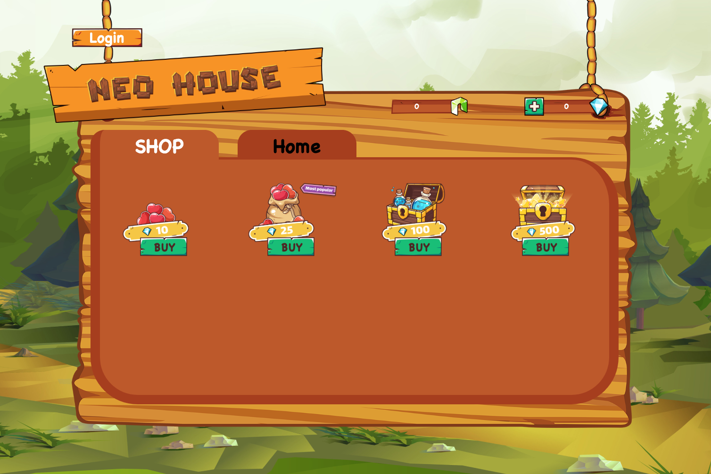

# Building a Dapp based on NEO


<div align="center">  
<h1>NEO-Tutorial</h1>

<p>Dapp Demo : NEO house</p>
</div>


In this tutorial we are going to build your first Dapp on the NEO, which is an online NEO game shop. This tutorial is for general developers who has basic knowledge of web development and understanding the usage of javascript. And before this tutorial, it is better to learn the [NEO smart contract development](https://github.com/neo-ngd/NEO-Tutorial/blob/master/9-smartContract/Smart_Contract_basics.md) first.

## Smart contract

The main purpose of this demo is to writing the smart contract and using the javascript to handle the front-end logic for its usage.

First of all, we need to write the smart contract part. The general idea of this NEO game shop is each item  in the shop has an ID, and the shop offer a kind of coupon which we can exchange from the store and then buy these items. Therefore, we can use the most part of [ITO]() contract, to let players exchange the coupon within the store, and then use the coupon to buy the Item.


## Front end


### Usage of neon-js

The [neon-js](https://cityofzion.io/neon-js/) JS SDK for NEO BlockChain. It make developer easy to call RPC methods of NEO and also provide some encapsulated function to call smart contract and sending assets. It includes the wallet functions and transaction functions.

To use neon-js in the browser, the simplest way is to include the source file in the html

```html
<script src="https://unpkg.com/@cityofzion/neon-js"></script>
```

### Login

First of all, each user has to provide their private key in the hexstring format or WIF format to Login, to create account

```js
let loginAccount = new Neon.wallet.Account(privateKey);
```

**important!** This is only for demo usage and do not use it in the real product. It is not safe to use the privateKey in such way directly. The better way to use the privateKey to send the transaction and provide signature is to delegate such security problem to wallet applications, such as desktop wallet or browser extension.


### Get balances

There is 2 kinds of asset we used in this demo Dapp. First one is `NEO` token and the second one is called `Diamond` which is a NEP-5 Token.


To check the `NEO` balance, just need to query the `neo-scan` api which is embedded in the neon-js sdk. Just call the `getBalance` method and the result include the unspent NEO token of this specific address.

```js
var privateNetNeoscan = new Neon.api.neoscan.instance("PrivateNet");
privateNetNeoscan.getBalance(loginAccount.address).then(res => {
    console.log(res);
    updateGasDisplay(res);
});
```

```js
function updateGasDisplay(balance) {
    if (balance.assets['NEO'] === undefined) {
        globalNEODisplayEle.innerText = '0';
        return ;
    }
    const unSpentUtxos = balance.assets['NEO'].unspent;
    let NEOAmount = 0;
    unSpentUtxos.forEach(unspent => {
        NEOAmount += unspent.value.toNumber();
    });
    globalNEODisplayEle.innerText =  NEOAmount;
}
```

To check the balance of the Diamond, we must call the `balanceOf` of the smart contract. To invoke the readonly method in the smart contract such as `balanceOf` or `name`, we just use the rpc query method to query the smart contract method. To call a readonly method in the smart contract, we have to provide two parameter, first is the contract address which is the scriptHash of the contract, the other one is the method name you want to call. Because function like `balanceOf` they need another parameter which is the address of the account you want to check.
After fill these parameter, we can call the rpc query method and get the result immediately and re-render the front-end.

```js
function invokeScriptReadOnly(method, callback) {
    const methodParam = Neon.default.create.contractParam("String", method);
    const addressParam = Neon.sc.ContractParam.byteArray(
      loginAccount.address,
      "address"
    );
    Neon.rpc.Query.invoke(
        CONTRACT_SCRIPTHASH,
        methodParam,
        Neon.sc.ContractParam.array(addressParam)
    ).execute("http://seed6.ngd.network:20332").then(res => callback(res));
}
```

### Exchange Diamond (Mint Token)

The initial balance of Diamond for a new user is 0. In order to get the diamond, the only way to do is to exchange it with NEO in your account. The method we have to call is the `exchange_token` function in the smart contract. The  method we use in the neon-js is `Neon.default.doInvoke`. Here we construct some elements this method will use. First one is intent, which is the transaction of UTXO asset (NEO token). It means we want to transfer some NEO to contract address (The address format of UTXO). Then here is the script part which needs to call the smart contract. It contains scripthash of smart contract, operation name and arguments of that method.


```js
  const intent = Neon.api.makeIntent({NEO:neoAmount}, CONTRACT_ADDRESS);
  const props = {
      scriptHash: CONTRACT_SCRIPTHASH,
      operation: "exchange_token",
      args: []
  };
  const script = Neon.default.create.script(props);

```

Next we put all the things into an object which we call with the `Neon.default.doInvoke` function. Here I call the object `config`. It includes the api method, the account which you create in the beginning, the intent that includes the UTXO asset transfer and the script which call the function in the smart contract.


```js
  const config = {
      api: testNetNeoScan,
      account: loginAccount,
      intents: intent,
      script: script
  };
```

Finally, we execute the `Neon.default.doInvoke(config)` and get the result back.


```js

Neon.default.doInvoke(config).then(res => {
      someCallback(res)
    }
}).catch(err => {
    console.log(err);
});

```

### Get items and buy new item

To check the item from the smart contract, it is as easy as get the balance. The only function we have to call is invokeScriptReadOnly, which is similar to call the balanceOf function. The only difference is the function name changed to the `checkItem`.

```js
invokeScriptReadOnly('checkItem', checkItemCallback);
```

To buy the new item, we have to use the doInvoke API of neon-js again.  It is similar to call the `exchange_token` function above. Here we use the nep-5 token only and do not need UTXO token. Therefore, we do not need the intent content and the only element we have to construct is the script and put it into a `config` object.


```js
const param_address = Neon.sc.ContractParam.byteArray(
      loginAccount.address,
      "address"
    );
const param_itemName = Neon.default.create.contractParam("String", ItemName);
const param_price = Neon.default.create.contractParam("Integer", price*1e8);

const props = {
    scriptHash: CONTRACT_SCRIPTHASH,
    operation: "buyItem",
    args: [param_address, param_itemName, param_price]
};
const script = Neon.default.create.script(props);
const config = {
    api: testNetNeoScan,
    account: loginAccount,
    script: script
};
```

Then, we execute the `Neon.default.doInvoke(config)` and get the result back.


```js

Neon.default.doInvoke(config).then(res => {
      someCallback(res)
    }
}).catch(err => {
    console.log(err);
});

```
